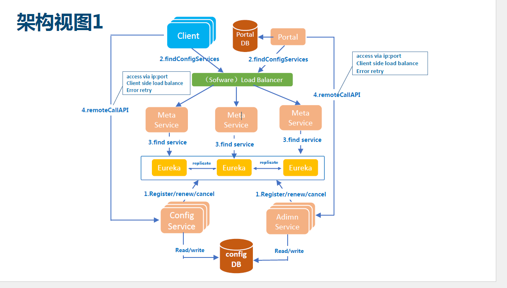
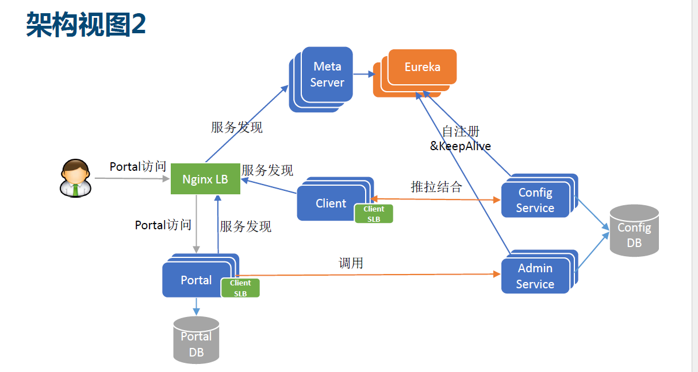
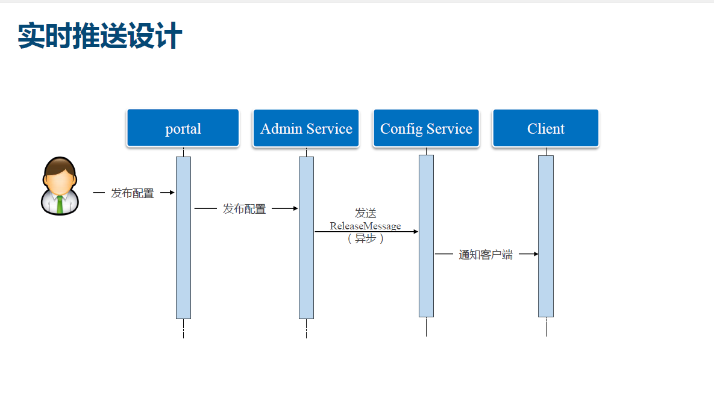
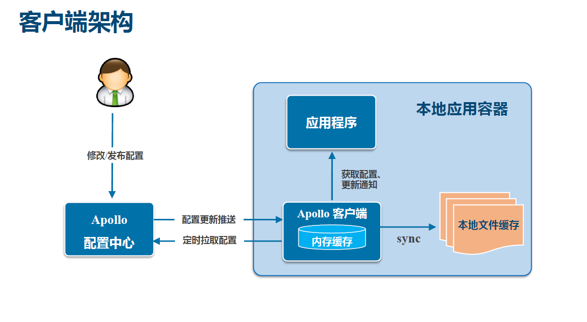

# apollo 入门
### apollo的功能亮点

1. 统一管理不同环境,不同集群的配置
2. 配置修改实时生效(热发布)
3. 版本发布管理
4. 灰度发布
5. 有权限管理
6. 文档完善 [apollo文档](https://github.com/ctripcorp/apollo/wiki)

### apollo基础模型

1. 用户在配置中心对配置进行修改并发布
2. 配置中心会通知客户端有配置更新
3. 客户端收到通知后,Apollo客户端从配置中心去拉取最新配置,更新本地配置并通知到应用

### apollo核心概念

#### 1.(application)应用,一个发布的单位

就是使用配置的应用,Apollo客户端在运行时,需要知道当前应用是谁,从而去获取到对应的配置

使用配置的应用要有唯一标示的aapid,由于应用身份是跟着代码走的,所以配置在代码中

* Java:classpath:/META-INF/app.properties -> appid=

#### 2.(environment)环境

* 配置对应的环境DEV,FAT,UAT,PRO,apollo客户端在运行时需要知道当前应用的运行环境,从而去获取到对应于该环境的配置.
* 环境默认读取 C:/OPT/SETTINGS/server.properties或/opt/settings/server.properties env=

的配置,同时也支持运行时通过System Properties 等制定 [java客户端方法](https://github.com/ctripcorp/apollo/wiki/Java%E5%AE%A2%E6%88%B7%E7%AB%AF%E4%BD%BF%E7%94%A8%E6%8C%87%E5%8D%97)

#### 3.(cluster)集群

* 一个应用下不同实例的分组,比如典型的可以按照数据中心分,把上海机房的应用实例分为一个集群,把北京机房的应用实例分为另外一个集群
* 对应不同的集群,同一个配置可以有不同的值,如Zookeeper的地址
* 集群默认是读取机器上的配置(server.properties的idc)),同时也支持运行时通过System Properties 等制定 [java客户端方法](https://github.com/ctripcorp/apollo/wiki/Java%E5%AE%A2%E6%88%B7%E7%AB%AF%E4%BD%BF%E7%94%A8%E6%8C%87%E5%8D%97)

### 4. namespace(命名空间)

* 一个应用下不同配置的分组,可以简单的把namespace类比为文件,不同类型的配置放在不同的文件中,如数据库配置文件
* 应用可以直接读取到公共组件的配置namespace
* 应用也可以通过读取公共组件的配置namespace来对公共组件的配置做调整

### apollo架构模块介绍

#### Config Service

* 配置推送接口
* 配置获取接口
* 主要服务apollo客户端

#### Admin Service

* 配置管理接口
* 配置修改,发布接口
* 主要服务于Protal

#### Meta Service

* Protal通过域名访问Meta Server 获取Admin Service 服务列表
* Client 通过域名访问Meta Server 获取Config Service服务列表
* 就相当于一个Eureka Proxy(本来只需要eureka,客户端和protal就可以进行服务发现admin/config service ,但是为了达到多语言的支持,使用 Meta Servcie 对eureka进行了一层薄薄的封装,让client和protal通过域名访问Mea Server 进而获取config/admin服务列表))

#### Eureka

* 服务注册于发现
* 服务Config/Admin Service的注册并报心跳

### 服务端架构视图

### 客户端架构视图

#### 客户端实现总结

##### 推拉结合

1. config Server 和客户端保持一个长连接,配置实现实时推送
2. 客户端定期从Config Server拉取配置

##### 配置缓存在本地

1. 客户端本地会再缓存一次

##### 应用程序

1. 通过apollo客户端获取最新配置
2. 订阅配置更新通知
