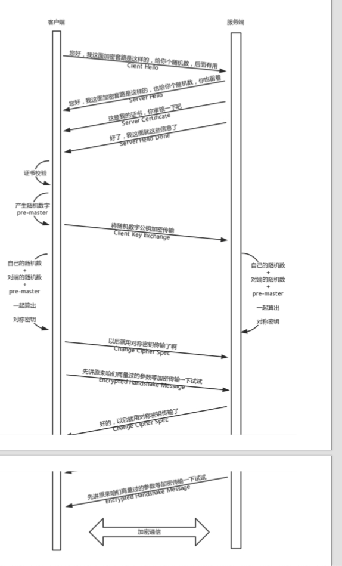
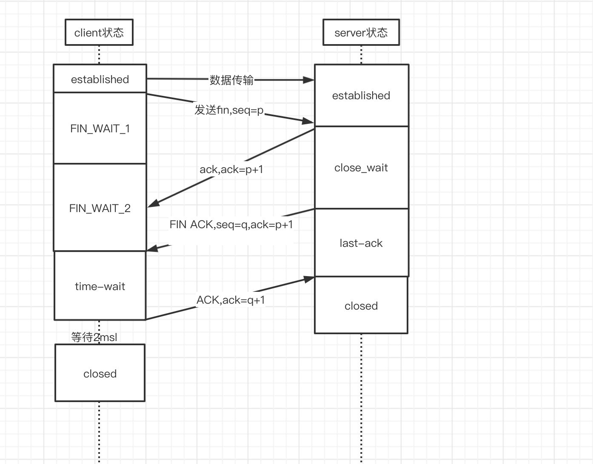

# 一次https请求的流程
   
## 相关名词解释

### https
  
 * 首先说一下https,https全文名称(hyper text transfer  protocol over SecureSocket layer) ,字面意思是在ssl基础上的
   http协议,在传统http的基础上,通过加密传输,身份认证(ssl)保证了传输过程的安全性,https相比如http不同的地方在于默认端口号的
   差别(http:80,https:443)及多了一个加密/身份验证层(ssl,在http和tcp之间)
 * http协议和安全协议都位于tcp/ip协议族的应用层,具体来说,安全协议运行在http协议之下,tcp协议之上,安全协议向运行http的
   进程提供一个类似tcp的套接字,供其注入报文,然后安全协议将其加密后注入到运输层socket,反正,将运输层socket返回的报文解密
   解密后交给对应的进程,严格地讲，准确来说,HTTPS并不是一个单独的协议，而是对工作在一加密连接（TLS或SSL）上的常规HTTP协议的称呼
    
### 对称加密和非对称加密
* 对称加密: 在对称加密算法中,加密和解密使用的秘钥是相同的,常见的是aes,des,加密和解密方同时持有一份秘钥

* 非对称加密: 在非对称加密算法中,加密使用的秘钥和解密使用的秘钥不是同一个,一个是可以被泄漏的公钥,另外一个是只有自己才会知道的秘钥,
公钥加密的信息,只有私钥才能解开,私钥加密的信息,只有公钥才能解开.这种算法比较复杂,且性能较低,所以交互的场景经常使用对称加密
  
### 证书
   * 由权威部门颁发的公钥秘钥对称为证书
   * 证书的组成有 **公钥** ,所有者,发布机构,有效期
   * 生成方式: 生成证书需要发起一个证书请求,然后将这个请求发给一个权威机构去认证,这个权威机构我们就称为 **CA**,CA用自己的私钥给网站的证书的hash值签名，就相当于给网站背书，形成了网站的证书
     然后客户端会用ca的公钥(大ca的公钥浏览器都会有,firefox自己维护,chrome自己从操作系统拿)对网站的证书进行校验,如果ca的公钥能够去解密这个网站证书的签名,那么就说明这个网站的公钥没啥问题

  
## 请求的过程 

### https的工作模式

> 由于对称加密和非对称加密的特点,公钥私钥主要用于传输对称加密的秘钥,而真正的双方大数据量的通信都是通过对称加密进行的,这就是https的总体思路

#### https 流程
##### dns解析成ip地址

##### tcp 三次握手
 > https的tls 是在可靠的tcp协议上构建安全的传输通道,其本身是不提供可靠性保障的,还是需要下层的传输层,在通信双方建立可靠地tcp连接之后,需要tls握手
来交换对称加密的传输秘钥
 1. client 发送syn,状态由close变成SEND,
 2. server 收到syn,发送syn和syn的ack,变成SYN_RECV
 3. client 收到 后,发送ack,进入establishd状态
 4. 服务端收到后,进入establishd状态,当然服务端这个时候不一定能收到这个ack,但是由于建立连接之后,客户端就会向服务端发送数据,所以当服务端接收到
之后,自然就会进入establishd状态

##### tls 握手
1. tcp握手成功之后,客户端会发送Client Hello消息到服务器,以明文传输TLS版本信息,加密套件候选列表,加密算法候选列表等信息.另外,
还会有一个随机数,在协商对称秘钥的时候使用
2. 然后网站会返回server Hello,告诉客户端,服务器选择的协议版本,加密套件,加密算法等,同时也返回一个随机数,用于后续的秘钥协商
3. 然后网站会返回一个服务端的证书,说 Server hello done ,我这里就这些了
4. 作为客户端肯定不会相信这个证书,于是客户端从自己信任的ca仓库中,拿ca的证书里面的公钥去解密外卖网站的证书.如果能够成功,则说明这个网站是可信的
5. 证书验证完毕以后之后,觉得这个网站可信,于是客户端计算产生随机数字 pre-master,发送client key exchange ,用证书中的公钥加密,再发给服务器,服务器可以
通过私钥解密出来,到目前为止,无论是客户端还是服务端,都有了三个随机数,自己的,对端的,以及刚生成的Pre-Master随机数.通过这三个随机数,可以在客户端和服务端
之间产生相同的对称秘钥
6. 此时客户端发送ChangeCipherSpec，指示server从现在开始发送的消息都是加密过的,咱们以后都采用协商的通信密钥和加密算法 进行加密通信了
   然后发送一个Encrypted Handshake Message将已经商定好的参数等采用协商密钥进行加密，发送给服务器用于数据与握手验证
7. 同样，服务器也可以发送 Change Cipher Spec，说：“没问题，咱们以后都采用协商的通信密钥和加密算法进行加密通信了”，并且也发送 Encrypted Handshake Message 的消息试试。
   当双方握手结束 之后，就可以通过对称密钥进行加密传输了

#####  握手完毕,双方开始正常通信
> 传输层->网络层->链路层

##### 断开连接,tcp4次挥手
> 当数据传输完毕之后,会进行连接的断开,链接的断开过程称为tcp的4次挥手
> 1. A: B啊,我不想玩了
> 2. B: 好啊,我知道了
> 3. B: a啊,我也不想忘了,拜拜
 4. A: 好的,我知道了,拜拜

    
1.   client 发送FIN,seq=q, 进入FIN_WAIT_1状态
2.   server 端回复ACK,ack=q+1,进入close_wait状态
3.  client 收到ACK,进入FIN-wait_2状态 
    * 如果这个时候服务端跑路了,那么client永远会停留在这个状态,tcp协议没有对这个状态做处理,但是linux有,可以设置一个超时时间
4. server端发送FIN,ACK通知client,进入LAST_ACK状态
5. client端收到后回复ACK,进入time_wait状态(最多等待2msl,等待之前的包传输完),后变成closed
6. server端收到ack,进入closed状态

     

      

