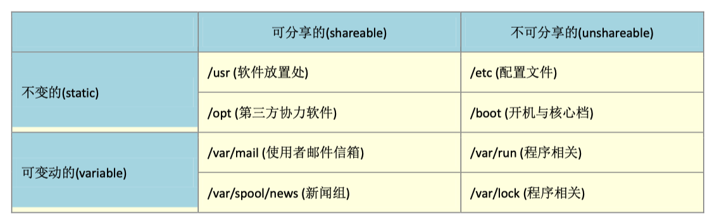

# linux 浅析

>说来惭愧,从工作至今没有对linux进行一次完整的学习,开始工作的时候会经常使用linux,但也仅限于看服务器日志等等一些皮毛,后面
>去了大一点的公司,基础设施很完善,都是容器化部署,rancher管理k8s集群,很少有机会通过jumpserver登录,最近在学习张磊老师的k8s的时候,许多设计到linux及内核的概念都不是很懂,故准备系统的学习一下linux

## linux 目录配置
>由于用linux来开发或者二次开发的用户实在是太多了,如果每个人都想用自己的想法来配置文件放置的目录,那么会非常的乱,因此就
>会有所谓的FHS标准,FHS将目录定义为四种交互作用的形态,如下图所示

1. 可分享的: 可以分享给其他系统挂载使用的目录,包括可执行文件和一些用户自身数据,其他系统拿到就可以直接使用的
2. 不可分享的: 自身机器上面的配置文件,
3: 不变的: 有些数据是不会经常变动的,例如函数库,说明文件等等
4: 可变的:经常改变的数据,例如登录文件,邮箱等等

实际上,fhs针对目录树结构仅仅定义三层目录底下应该放什么数据而已

1. / (root, 根目录)：与开机系统有关；
2. /usr (unix software resource)：与软件安装/执行有关；
3. var (variable)：与系统运作过程有关。

