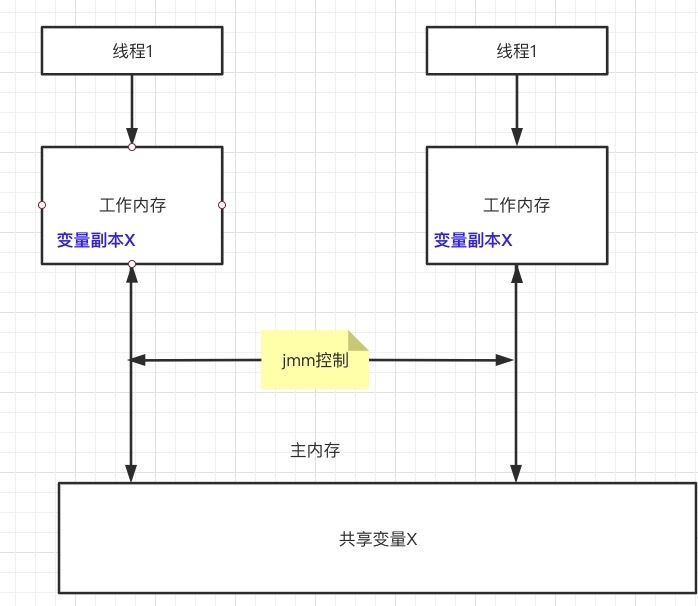

# volatile浅析
#### 简介
1. volatile 关键是用来修饰静态变量和实例变量的,对于方法参数,局部变量和实例常量和类常量都不能修饰
2. volatile修饰的类变量和实例变量能保证两次语义
   * :保证了不同线程对共享变量操作时的可见性,即一个线程对变量的修改,其他线程能够立马获取到最新的值
   * :禁止了指令重排序
#### 历史背景,机器硬件cpu

#### java内存模型
1. java内存模型指定了jvm虚拟机和主内存之间如何进行交互,工作,他指定了一个线程对共享变量的修改何时对其他线程可见,定义了线程与主内存之间的抽象关系,具体如下
   * 共享变量储存于主内存中,所有的线程都可以访问
   * 每个线程都有私有的工作内存,也被称为本地内存(这个工作内存指的是一个抽象的概念,并不是实际存在,它涵盖了缓存,寄存器,编译器优化等)
   * 工作内存只存储该线程对共享变量的副本
   * 线程不能直接操作主内存,只有先操作了工作内存之后才能写入主内存
   * 工作内存和jmm一样都是一个抽象概念,不是实际存在的
  

#### 并发编程的三大特性与jmm

1. **原子性**
    * 原子性指的是一次操作或者多次操作中,要么是所有的指令都能得到成功执行,要么就是都不执行,就事务的acid中的原子性是一样的
    * jmm能够保证基本类型和引用类型的赋值是原子性的,但是多个原子性的操作合在一起,并不一定就是原子性的,例如i++操作(1:从主内存中读取i(如果工作内存中存在i的副本则直接拿) 存入到工作内存中;2:在调用线程的工作内存中进行+1运算;3:将运算后的值写入到主内存中去)
    * volatile关键不能保证原子性,synchronized关键字可以保证原子性,juc的lock和原子类型变量同样也可以保证原子性
2. **可见性**
    * 可见性指的是一个线程对共享变量进行了修改,那么另外的线程可以立即看到修改后的最新值
    * volatile和synchronized,juc的lock都可保证可见性
3. **有序性**
    * 所谓的有序性指的是代码运行过程中的先后顺序,在现代的cpu中,一般为了程序运行的速度,会对代码的运行顺序做一定的优化,他不会保证代码的运行顺序完全按照编写的顺序来,会进行指令重排序,但是他可以保证最终的运行结果是编码所期望的,这种情况在单线程的环境没有问题,但是在多线程的环境下,有序性得不到保证会出大问题,类似于依赖flag进行初始化的程序
    * volatile和synchronized,juc的lock都可保证可见性,后两者是通过同步的机制来保证的,同步的代码在执行的时候就和单线程的情况下一样自然能够保证顺序性(最终结果的顺序性)
    * jmm具有一些天然的有序性规则,不需要进行额外的同步就可以保证有序性,这个称为happen-before原则,如果两个操作的次序不能够从happen-before原则中推断出来,那么这两个操作就不具有有序性,虚拟机和处理器可随意进行重排序

##### happen-before原则
  * 程序次序原则:在一个线程内,代码按照编写的次序执行,编写在后面的操作发生在编写的前面的操作之后,这个并不是说不会进行指令重排序,只是说在一个线程内,程序运行的结果会按照预期的进行
  * 锁定规则:一个unlock操作要先行发生于对一个锁的lock操作:无论在单线程还是多线程内,如果同一个锁是锁定状态,那么必须先对其执行释放操作之后才能继续进行lock操作
  * volatile变量原则:对一个变量的写操作发生在对一个变量的读操作之前,如果一个线程对一个volatile变量进行写操作,另外一个线程进行读操作,那么写操作一定发生在读操作之前
  * 传递原则:如果a happen-before b,b happen-before c,那么a 一定happen-before c
  * 其他的没啥意义
 
 ##### 总结
volatile具有 可见性和有序性
  
#### volatile关键字的原理
 1. volatile如何保证修改的共享变量,其他线程能够马上获取到?
 2. volatile 如何保证有序性,很暴力,直接禁止
 
* 主要是通过 **lock;** 内存屏障来实现的,cpp的源码显示,每个volatile关键字的前面都会有一个lock;前缀,这个前缀他能保证几层语义
  1. 强制将线程工作内存中的值的修改刷新到主内存
  2. 如果是写操作,会导致其他工作内存中的缓存数据失效,必须重新从主内存中去拿
  3. 确保指令重排序的时候不会将其前面的代码排到内存屏障之后
  4. 确保指令重排序的时候不会将其后面的代码排到内存屏障之前
  5. 确保代码执行到内存屏障的时候前面的代码已经全部执行完毕
    

#### volatile的使用场景 
 1. 开关控制作为可见性的特点
 2. 状态标记你用有序性特点,单例模式的double-check也是利用了顺序性特点
 

#### volatile和synchronized的区别
  ##### 使用方式上
   1. volatile只能修饰实例变量和静态变量,不能修饰成员变量,方法参数,类变量,方法上,而synchronized可以修饰方法和代码块上
   2. volatile修饰的变量可以为null,synchronized需要的lock不可能为null
  ##### 作用上
  1. 可见性的实现方式
     1. volatile是通过内存屏障的手段来实现的,修改后强制刷新到主内存,同时将其他工作内存中的值失效,而synchronized是通过lock的排他性来实现的,具体是同一时间只有获取锁的单个线程才对代码块或者方法进行操作,在锁释放的时候强制将工作内存中的数据刷新到主内存中去
  2. 有序性的实现方法
     1. volatile是通过禁止编译器和虚拟机的指令重排序来保证有序性
     2. synchronized 是通过同步,串行化的方式来保证代码块的有序性,同一时间只有获取锁的线程才能执行,就相当于单线程了,也就不存在有序性的问题了,但是同步代码块的里面的代码仍然可以进行重排序
  3. 原子性的实现方法
      1. volatile不能保证原子性
      2. synchronized是一种排他的机制,因此被synchronized修饰的代码是无法中途被打断的,所以synchronized是可以保证原子性的
     

